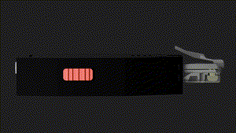
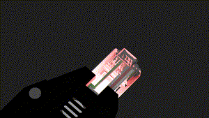

# Lichee-Jack
> A low-cost, DIY social-engineering LAN Attack & Penetration Testing Army knife

## About

**Lichee-Jack** is a low-cost, DIY **social-engineering LAN Attack & Penetration Testing Army knife** inspired by the **Hak5 SharkJack**.
It is designed for **payload delivery**, **opportunistic wired auditing**, and **red-team / SE engagements** in environments where localnet is accessible.

Lichee-Jack combines **USB gadget functionality**, **on-board Ethernet**, and **hardware mode selection** into a compact, fully open-source platform.

> 100% open-source hardware & software
> Built for hackers, auditors, and embedded developers

---

## Features

- **USB gadget functions**
  - Powered by **gt (linux-usb-gadgets)**
  - CDC-ECM, RNDIS, HID, Mass-Storage (payload-dependent)
- **10/100 Mbps onboard Ethernet (GMAC)**
- **Sipeed LicheeRV Nano** (SG2002 SoC, RISC-V)
- **Open-source extension board**
  - 200 mAh Li-Po battery management (≈ 1+ hour uptime)
  - NeoPixel **RGB LED RJ45 status indicator**
  - **SP3T mode-switch** for payload / debug selection
  - 2×10 1.27 mm header for extension modules
- **Wi-Fi 6 + Bluetooth 5.2** (SDIO module)
- **1 W onboard speaker**
- **16-bit digital microphone**
- **Micro-SD boot**
- **3D-printable enclosures**

---

## How it works

Lichee-Jack is designed to operate as a **plug-and-execute** LAN implant with minimal user interaction.

### 1. Power & deployment

The device can be powered via:
- USB (host or charger)
- Internal Li-Po battery

Once powered, it boots directly from the SD card into a minimal Debian Linux environment.

---

### 2. Mode selection (hardware switch)

A physical **SP3T mode-switch** selects the operating mode **before boot**:

| Mode | Purpose |
|-----:|--------|
| 0 | Debug / development mode |
| 1 | Payload 1 execution |
| 2 | Payload 2 execution |

The selected mode determines:
- Which payloads are executed
- Which USB gadget functions are exposed
- LED behavior and system services

---

### 3. Payload execution

Payloads are **shell-based** and executed automatically after boot.

Typical payload actions include:
- Network reconnaissance (ARP, DHCP, SNMP, mDNS)
- Traffic redirection or MITM setup
- Data exfiltration over USB or Ethernet
- LED / audio feedback for execution state

Payload logic is **transparent and modifiable** — no obfuscation, no closed binaries.

---

### 4. Visual & physical feedback

- **RJ45 RGB LED**
  - Boot status
  - Link state
  - Payload activity
  - Error conditions
- Optional **audio cues** via onboard speaker

This allows the operator to understand the device state **without connecting a terminal**.

---

### 5. Access & control

Depending on configuration, Lichee-Jack can expose:
- USB Ethernet (CDC-ECM / RNDIS)
- USB serial console
- SSH over USB or LAN

All services are controlled via init scripts and build-time configuration.

---

## Contributors

Lichee-Jack is developed as a **community-driven open-source project**.

- **KaliAssistant** — Project author & maintainer
- Community contributors — hardware, firmware, payloads, documentation

Contributions are welcome:
- Payloads
- Hardware extensions
- Documentation improvements
- Bug fixes

---

## Disclaimer

Lichee-Jack is an **open-source research and development platform** intended for **education, security research, and authorized testing only**.

This project is designed to help users understand:

* USB gadget frameworks on Linux
* Embedded Linux system design
* Network protocols and diagnostics
* Hardware / software co-design for security tooling

⚠️ **Legal & ethical use required**

You are solely responsible for how you use this device and its software.

* **Do not** use Lichee-Jack on networks, systems, or devices you do not own or explicitly have permission to test.
* **Do not** use it for unauthorized interception, disruption, or data extraction.
* **Always** comply with local laws and regulations.

The authors and contributors **assume no liability** for misuse, damage, data loss, or legal consequences arising from use of this project.

If you are unsure whether a use-case is legal or permitted — **do not proceed**.

---

## License

Lichee-Jack is a **fully open-source project**. Different parts of the project are licensed as follows:

### Software

* Licensed under the **GNU General Public License v3.0 (GPL-3.0)**
* This includes:

  * System scripts
  * Payload framework
  * Build tools
  * Init services

You are free to:

* Use
* Study
* Modify
* Redistribute

**Under the condition** that derivative works remain open-source and are distributed under the same license.

### Hardware & PCB Design

* PCB schematics and layouts are licensed under the **GNU General Public License v3.0 (GPL-3.0)**

This includes:

* Schematics
* PCB layout files
* Netlists
* Manufacturing outputs (when derived from GPL sources)

Any modified or redistributed PCB design must:

* Retain GPL-3.0 licensing
* Provide corresponding source design files

This ensures hardware designs remain fully open and auditable.

### Mechanical / 3D Models

* 3D-printable enclosures (STL/STEP) are released under **CC BY-SA 4.0** unless otherwise noted.

This ensures:

* Attribution is preserved
* Modifications remain open
* Community improvements flow back

Please check individual directories for exact license headers.

---

## Security Philosophy

Lichee-Jack follows a **transparent-by-design** philosophy:

* No hidden payloads
* No closed binaries
* No phone-home behavior
* No obfuscation

Every action taken by the device can be audited by reviewing:

* Shell scripts
* Init logic
* Payload sources

This makes Lichee-Jack suitable for:

* Blue team learning
* Red team labs
* Academic demonstrations
* Defensive research

---

## Project Status

* Hardware: **Active development**
* Software: **Usable / evolving**
* Documentation: **In progress**

This is **not a mass-produced commercial product**.

Expect:

* Rough edges
* DIY assembly
* Iterative improvements

Community feedback and contributions directly shape the roadmap.

---

## Trademarks & Attribution

Lichee-Jack is an **independent project**.

* Not affiliated with Hak5, Shark Jack, or any commercial implant vendor
* Inspired by existing open security tools and community research

All trademarks belong to their respective owners.

---

## Full Documentation

Complete documentation, build guides, hardware details, and payload development references are maintained in the **Lichee-Jack Wiki**.

👉 **Lichee-Jack Wiki**: [https://kaliassistant.github.io/Lichee-Jack-wiki](https://kaliassistant.github.io/Lichee-Jack-wiki)

The wiki includes:

* Hardware architecture & schematics overview
* Extension board and pinout documentation
* System boot flow and init logic
* USB gadget framework (gt) configuration
* Payload development guides
* Build-from-source instructions

For in-depth technical details, please refer to the wiki.

---

## Get Involved

If you want to help:

* Submit payloads
* Improve documentation
* Design extension boards
* Review security logic

Please see the repository contribution guide.

**Hack responsibly. Build openly. Learn deeply.**

