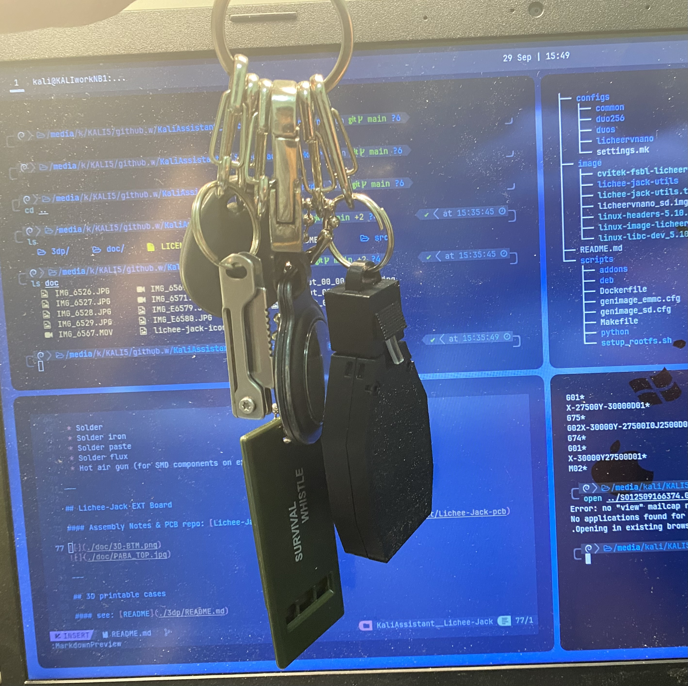

# Lichee-Jack
> Portable social-engineering LAN tool for automated payloads and wired audits — Best alternative to Hak5 SharkJack

## About

**Lichee-jack** is a low-cost, DIY social engineering LAN implant inspired by the Hak5 SharkJack. 
Designed for payload delivery, opportunistic wired auditing, and SE engagements, it features mod-switch mode control, RGB LED RJ45 feedback, and USB gadget interfaces.

The original idea for **Lichee-Jack** came from the **fox-jack** repo (available on my GitHub). However, the original design had several challenges: the size was too large, the SDK didn’t support glibc, and there were PCB design issues. To address these problems, I decided to use the **SIPEED licheervnano**. 

The **licheervnano** offers a smaller PCB size and better performance, with the root filesystem running **Debian**. It also supports **WiFi6**, has the same **SP3T mod-switch** (PCB-side slide toggle switch), and uses a **200mAh LiPo battery** with around **1 hour of uptime**.

### Features

* **USB gadget function**: **gt** by **linux-usb-gadgets**
* **10/100 Mbps onboard GMAC Ethernet**
* Based on **SIPEED licheervnano (sg2002)**
* **open-source extension board PCB Design**:
    * **200mAh LiPo battery support** (~1hr uptime)
    * **NeoPixel RGB LED RJ45** status indicator
    * **SP3T mod-switch** to select payloads
* **3D-printable cases**
* **Rootfs**: **Debian stable**
* **Boot**: **SD card**
* **U-Boot**: **sophgo official repo fork**
* **Kernel**: **sophgo official linux-5.10 fork**

---

## Repository Contents

* **sophgo official SDK**
* **Image build scripts**
* **3D-printable case designs**
* **Extension board PCB design**:
    * KiCad project
    * Gerber files
    * BOM
    * CPL

---

## Part List

| Item                                    | Qty | Link |
| --------------------------------------- | --- | ---- |
| SiPeed licheerv nano (WE/W only)        | 1   | [Amazon](https://a.co/d/bqAde1m) |
| M2x0.4 Heat-Set Thread Insert (D3×H2)   | 4   | [Amazon](https://a.co/d/6mJeA5C) |
| M2x0.4 Ultra-Low Head Torx Screws (3mm) | 2   | [Amazon](https://a.co/d/fiHYJ7t) |
| M2x0.4 Hex Socket Head Cap Screws (6mm) | 2   | [Amazon](https://a.co/d/4TCJOGo) |
| 402030 Lipo 3.7v battery (1C discharge) | 1   | [Amazon](https://a.co/d/eNNC0nF) |

> [!NOTE]
> PCB & BOM: all files in the `pcb/` directory(git submodule)

---


## Required Tools

* Soldering tools:

  * Solder
  * Solder iron
  * Solder paste
  * Solder flux
  * Hot air gun (for SMD components on extension board)

---

## Lichee-Jack EXT Board

#### Assembly Notes & PCB repo: [Lichee-Jack-pcb](https://github.com/KaliAssistant/Lichee-Jack-pcb)


---

## 3D printable cases

#### see: [README](./3dp/README.md)




---

## Build Instructions

1. Create a Debian/Ubuntu/Kali (or other Debian-based) Linux environment
   *(You can use a VM or physical machine — author uses a Debian laptop)*

2. Clone the repository:

    ```bash
    git clone https://github.com/KaliAssistant/Lichee-Jack.git
    ```

3. Install required dependencies:
    ```bash
    sudo ./dep.sh
    sudo apt update
    sudo apt install -y docker.io kconfig-frontends make cmake automake autoconf libtool libtool-bin rsync
    ```

4. Navigate into the builder:

   ```bash
   cd sophgo-sg200x-debian
   ```

5. Build the docker image:

    ```bash
    ./build_docker.sh
    ```

6. Run image build script:

    ```bash
    ./build_image.sh
    ```

7. The resulting SD image will be written to: `sophgo-sg200x-debian/image/licheervnano_sd.img`. To write the image to your SD card (replace `/dev/<your-sd>`):

    ```bash
    sudo dd if=./image/licheervnano_sd.img of=/dev/<your-sd> bs=4M status=progress conv=fsync
    sudo sync
    ```

> [!IMPORTANT]
> double-check `/dev/<your-sd>` before running `dd`.

---

## Configuration: `licheejack.toml`

Create a TOML config file at `/root/config/licheejack.toml` on the device. Example:

```toml
[network]
end0.static.ipv4_addr = "172.16.80.1/24"
end0.static.gateway = ""

end0.dhcp_server.ipv4_addr = "192.168.87.1/24"
end0.dhcp_server.listen_address = "192.168.87.1"
end0.dhcp_server.dhcp_range = "192.168.87.10,192.168.87.254,255.255.255.0,60m" # dnsmasq format
end0.dhcp_server.dhcp_options = [["3", ""], ["6", ""]]
end0.dhcp_client.dns_servers = [ "1.1.1.1", "8.8.8.8" ]

[authentication]
shadow = [
  "root:$y$j9...............................eznl89d19/...................dh5:20351:0:99999:7:::",
  "debian:$y$j...............................R2cZ1I2s/..................dh5:20351:0:99999:7:::"]
ssh.root_login = "prohibit-password" # password|key|no
ssh.allow_hosts = [
  ["root", "ssh-ed25519 AAAAC3N............................................qhyMb91BK kali@KALI"],
  ["debian", "ssh-ed25519 AAAAC3Nz........................................xxxxMb91BK kali@KALI"]
]
```

Save the file as `/root/config/licheejack.toml` on the device (or copy it later via SCP when in factory mode).

---

## TOML configuration fields (detailed)

Below is a detailed description of the commonly used `licheejack.toml` fields and how they map to generated NetworkManager connection files and `dnsmasq` configuration.

```toml
[network]
end0.static.ipv4_addr = "172.16.80.1/24"
end0.static.gateway = ""

end0.dhcp_server.ipv4_addr = "192.168.87.1/24"
end0.dhcp_server.listen_address = "192.168.87.1"
end0.dhcp_server.dhcp_range = "192.168.87.10,192.168.87.254,255.255.255.0,60m" # dnsmasq format
end0.dhcp_server.dhcp_options = [["3", ""], ["6", ""]]
end0.dhcp_client.dns_servers = [ "1.1.1.1", "8.8.8.8" ]

[authentication]
shadow = [
  "root:$y$j9...............................eznl89d19/...................dh5:20351:0:99999:7:::",
  "debian:$y$j...............................R2cZ1I2s/..................dh5:20351:0:99999:7:::"]
ssh.root_login = "prohibit-password" # password|key|no
ssh.allow_hosts = [
  ["root", "ssh-ed25519 AAAAC3N............................................qhyMb91BK kali@KALI"],
  ["debian", "ssh-ed25519 AAAAC3Nz........................................xxxxMb91BK kali@KALI"]
]
```

### Field explanations and mappings

* `end0.static.ipv4_addr` / `end0.static.gateway`

  * Used to generate `static.nmconnection` (NetworkManager file):

    ```ini
    [connection]
    id=static
    uuid=<uuidgen>
    type=ethernet
    autoconnect=false
    interface-name=end0

    [ipv4]
    address1=172.16.80.1/24
    method=manual
    ```

* `end0.dhcp_server.*`

  * Generates `dhcp-server.nmconnection` plus `dnsmasq.conf` entries. Example `dhcp-server.nmconnection`:

    ```ini
    [connection]
    id=dhcp-server
    uuid=<uuidgen>
    type=ethernet
    autoconnect=false
    interface-name=end0

    [ipv4]
    address1=192.168.87.1/24
    method=manual
    ```
  * `dnsmasq.conf` lines produced from the TOML fields:

    ```text
    listen-address=192.168.87.1
    dhcp-range=192.168.87.10,192.168.87.254,60m
    dhcp-option=<tag>,<value>   # generated from dhcp_options entries
    ```

* `end0.dhcp_client.dns_servers`

  * Generates `dhcp-client.nmconnection` for a DHCP client profile used when the interface should act as a client:

    ```ini
    [connection]
    id=dhcp-client
    uuid=<uuidgen>
    type=ethernet
    autoconnect=false
    interface-name=end0

    [ipv4]
    dns=1.1.1.1;8.8.8.8;
    method=auto
    ```

* `[authentication]` / `shadow`

  * Entries in `shadow` are applied to `/etc/shadow` to set hashed passwords for accounts (root, lichee, debian, etc.). Provide properly generated salted hashes — do not store plaintext passwords.

* `ssh.root_login`

  * Controls `PermitRootLogin` in `/etc/ssh/sshd_config`. Valid values: `password`, `key`, `no`, `prohibit-password`.

* `ssh.allow_hosts`

  * Use `ssh.allow_hosts` in `licheejack.toml` to provision public keys for users and automatically populate their `~/.ssh/authorized_keys`. The expected format is an array of `[username, key]` pairs.

  * Example TOML entry:

    ```toml
    ssh.allow_hosts = [
    ["root", "ssh-ed25519 AAAAC3NzaC1lZDI1NTE5AAAAIBExampleKeyForRoot kali@KALI"],
    ["debian", "ssh-ed25519 AAAAC3NzaC1lZDI1NTE5AAAAIBExampleKeyForDebian user@HOST"]
    ]
    ```
  * What the provisioning does (typical behavior performed by `jackconf apply`):

    * For each `[user, key]` pair:

    * Ensures the user account exists (if not, the key can be written to `/root/.ssh/authorized_keys` or the user's home depending on your policy).
    * Creates the user's `~/.ssh` directory with mode `0700`.
    * Appends the public key to `~/.ssh/authorized_keys` (mode `0600`) if it is not already present.
    * Sets correct ownership (`chown user:user`) on `.ssh` and `authorized_keys`.


### Notes & tips

* `uuid` values in generated `*.nmconnection` files should be generated with `uuidgen`.
* `dhcp_range` follows `dnsmasq` format: `start,end,lease` (optional netmask omitted in some forms). If you need to include netmask, use `start,end,netmask,lease`.
* `dhcp_options` should be an array of `[ ["option", "value"], ... ]`. For example `[["3",""],["6","" ]]` will produce `dhcp-option=3` and `dhcp-option=6` (gateway and DNS respectively) — if a value is empty the option will be added without a parameter.
* When creating `shadow` hashes on your host use **yescrypt** (recommended). Example methods:

  * `mkpasswd --method=yescrypt` (if available on your system)
  * Python: `python -c "import crypt; print(crypt.crypt('yourpassword', crypt.mksalt(crypt.METHOD_YESCRYPT)))"` (requires a Python build with `METHOD_YESCRYPT`)

  Provide yescrypt hashes in the `shadow` array — do **not** store plaintext passwords.
* Always validate generated NetworkManager files with `nmcli connection load <file>` or by placing them under `/etc/NetworkManager/system-connections/` and checking `nmcli connection show`.

---

## Prepare `udisk.img` (USB Mass Storage for payloads & loot)

Create a 200 MB FAT image called `udisk.img` to act as UMS storage for payloads and loot:

```bash
dd if=/dev/zero of=udisk.img bs=1M count=200 status=progress
sudo losetup --show -fP udisk.img
# Suppose loop device is /dev/loop0; format it:
sudo mkfs.vfat -F 32 -n "LICHEE-JACK" /dev/loop0
sudo losetup -d /dev/loop0
```

Create the directory tree to populate the image (example):

```
.
|-- loot
|-- payloads
    |-- mod1.d
    |-- mod2.d
```

Copy payloads and loot into the image before detaching, or write files to the UMS disk when the device is plugged in DEBUG mode.

---

## First boot & workflow

1. Insert the SD card into Lichee-Jack.
2. Make sure the SP3T mod-switch is in **pos0 (DEBUG MODE)**.
3. Plug a data-capable USB-C cable from the device to your computer.
4. Wait ~30s for boot. The device will announce **FACTORY MODE** and the LED will blink yellow (~1 Hz).
5. Your computer should detect a new USB RNDIS Ethernet interface and acquire DHCP in `10.42.0.x/24`. Lichee-Jack will be `10.42.0.1`.
6. Copy `udisk.img` to `/root` on the device (SCP — `root:toor` by default) and copy `licheejack.toml` to `/root/config/`.

    ```bash
    scp udisk.img root@10.42.0.1:/root
    scp licheejack.toml root@10.42.0.1:/root/config/
    ```

7. SSH into the device as root and run:

    ```bash
    ssh root@10.42.0.1
    # then on device:
    jackconf apply
    reboot
    ```

8. After reboot the device will come up in **DEBUG MODE**. Your computer should now see RNDIS + UMS disk. You can edit payloads directly on the UMS disk.

---


